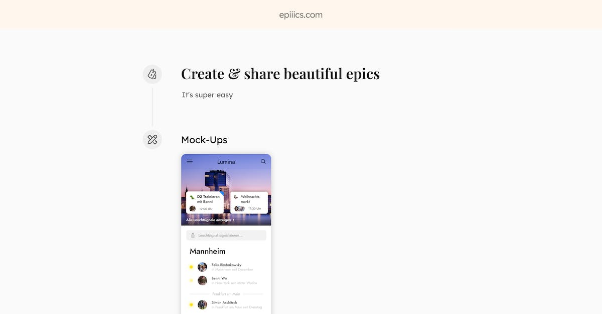

# epiiics.com

Epiiics is a small web-app that allows its users to quickly define product epics. The user can create their page by adding components that show text, images, links or goals.
It's available at [ta-epics.web.app](https://ta-epics.web.app) and built using Angular with Firebase Firestore and Firebase Storage. 

The entire project was designed, built and released over a weekend as part of a personal challenge, learn more in [this LinkedIn post](https://www.linkedin.com/posts/moritzbruder_epiiics-define-and-share-your-engineering-activity-6792484333409107968-F4_Z) or on [Product Hunt](https://www.producthunt.com/posts/epiiics).

A sample site can be found at [ta-epics.web.app/sample](https://ta-epics.web.app/sample)

This project was generated with [Angular CLI](https://github.com/angular/angular-cli) version 11.2.10.

## Development server

Run `ng serve` for a dev server. Navigate to `http://localhost:4200/`. The app will automatically reload if you change any of the source files.

## Build

Run `ng build` to build the project. The build artifacts will be stored in the `dist/` directory. Use the `--prod` flag for a production build.

## Design

The application was designed in Sketch, the file can be found in [concept/epiiics.com.sketch](concept/epiiics.com.sketch)
